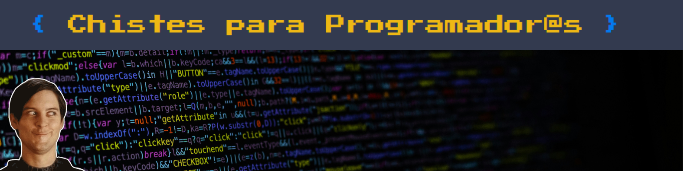

<div align='center'>
    <a href="https://tinchogithub.github.io/chistes-para-programadores/" target="_blank">
          
       </a>
</div>

## Descripción

Este proyecto es un desafío del programa Codo a Codo 4.0. El objetivo del proyecto es consumir una API y mostrar contenido en el front-end. En este caso, se consume la API [JokeAPI](https://v2.jokeapi.dev/joke) para mostrar chistes para programador@s al presionar un botón.

## Tecnologías

Este proyecto utiliza las siguientes tecnologías:


## Funcionalidad

Al presionar el botón en la página principal, se realiza una solicitud a la API de chistes y se muestra un chiste relacionado con la programación en el front-end. Dependiendo del tipo de chiste recibido (de una parte o de dos partes), se presenta de manera adecuada en la interfaz de usuario.

## Uso

1. Clona este repositorio en tu máquina local.
2. Abre el archivo `index.html` en tu navegador.
3. Haz clic en el botón para obtener un chiste y mostrarlo en la página.

## Instalación

Para correr este proyecto localmente, sigue estos pasos:

1. Clona el repositorio:
   ```sh
   git clone https://github.com/tu-usuario/chistes-para-programadores.git

2. Navega al directorio del proyecto:
   ```
   cd chistes-para-programadores
3. Abre index.html en tu navegador preferido.

## Contribución
Las contribuciones son bienvenidas. Si deseas contribuir, por favor sigue estos pasos:

1. Haz un fork del proyecto.
2. Crea una nueva rama (feature/nueva-funcionalidad).
3. Realiza tus cambios.
4. Envía un pull request.

## Licencia
Este proyecto está bajo la licencia MIT. Para más detalles, revisa el archivo LICENSE.

¡Gracias por visitar este proyecto y disfrutar de los chistes para programadores! 🚀